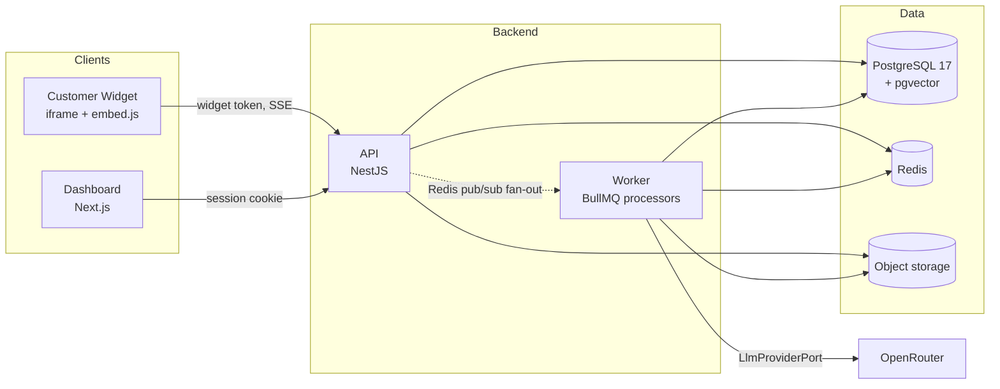
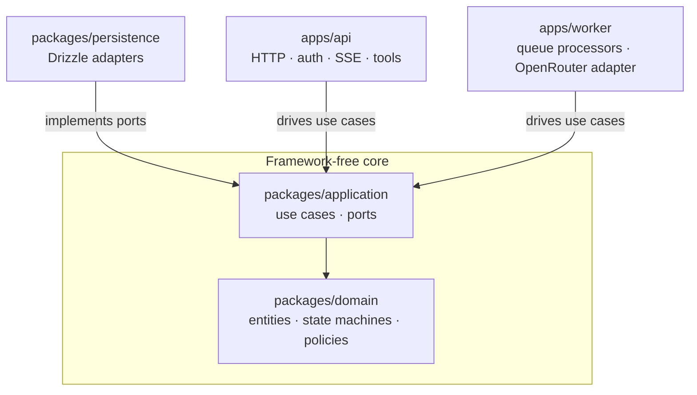
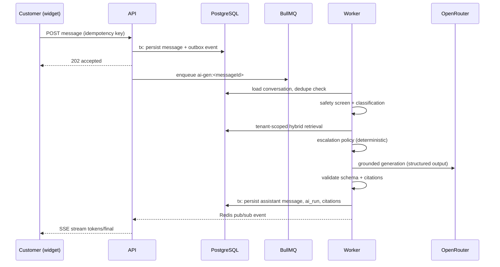
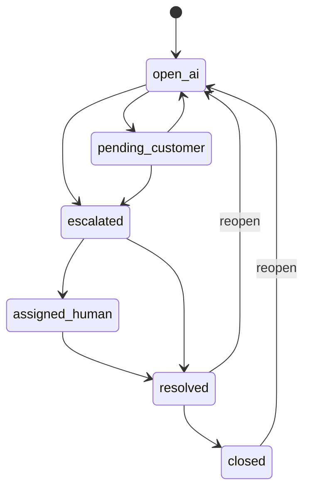

# Architecture

## System overview

## Hexagon

Dependency rule: everything points inward. `domain` and `application` import no framework, ORM, queue, or vendor SDK. See ADR 0002.

## Bounded contexts

Identity & Access · Organizations & Tenancy · Knowledge Management · Conversations · AI Orchestration · Agent Workspace · Tool Execution · Feedback & Quality · Analytics · Audit & Compliance · Notifications · Billing & Usage.

Contexts communicate through application services and outbox domain events. No context reads another context's tables directly.

## Message → AI response flow

Key invariants:
- User message is durable **before** AI work starts; API restarts lose nothing.
- Processing is idempotent (deterministic idempotency keys) — duplicate job delivery cannot create duplicate messages.
- Citations must map to actually retrieved evidence; zero valid citations ⇒ abstain + offer escalation.
- Tool proposals pass a deterministic gate: schema validation → actor auth → tenant ownership → business rules → confirmation if consequential → execute → sanitize → audit.

## Conversation state machine

Invalid transitions are rejected in the domain layer. AI suggestions are never auto-sent while a conversation is human-controlled.

## Tenancy

Every tenant-owned table carries `organization_id`. Scope derives from authenticated context (session, API key, widget token) — never from client input. Composite indexes lead with the org id; retrieval, caches, queue payloads, and storage paths are all tenant-scoped; RLS is defense in depth (ADR 0005).

## Ingestion pipeline

validate → store original (S3) → extract/normalize → detect language → sanitize markup → chunk (configurable) → embed → persist chunks+vectors → flip version to indexed (last step, atomic). Content-hash idempotency, versioning, DLQ, SSRF-guarded URL ingestion. Failed runs never touch the active version.

## Failure design summary

| Failure | Behavior |
|---|---|
| LLM timeout/outage | retry w/ backoff+jitter, circuit breaker, DLQ; humans unaffected |
| Invalid model output | schema validation fails run → retry → abstain+escalate |
| Postgres outage | full stop by design (source of truth); queues drain on recovery |
| Redis outage | processing pauses; outbox drainer recovers lost enqueues |
| Worker crash | at-least-once redelivery; idempotent effects |
| Client disconnect mid-stream | state persisted server-side; client re-fetches on reconnect |
| Duplicate submission | idempotency keys at message, job, and tool layers |
